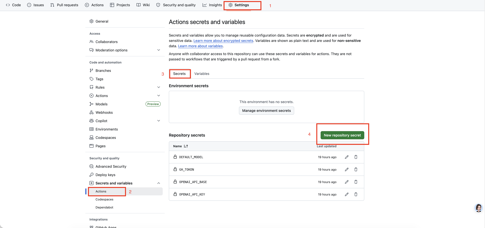
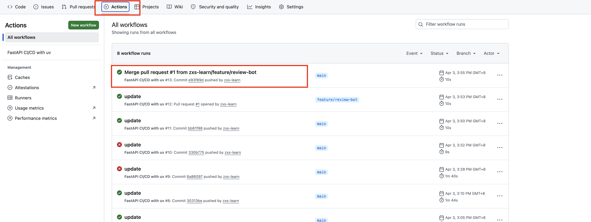
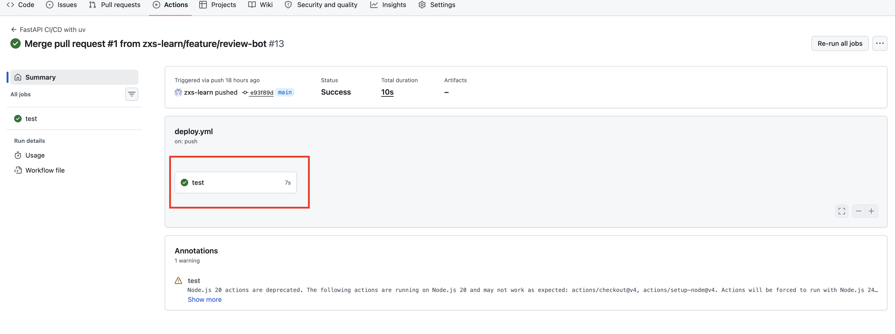
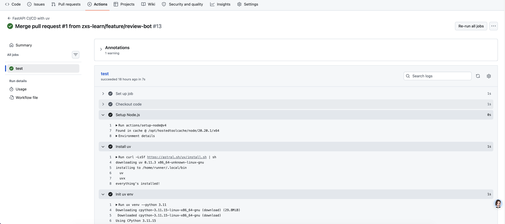
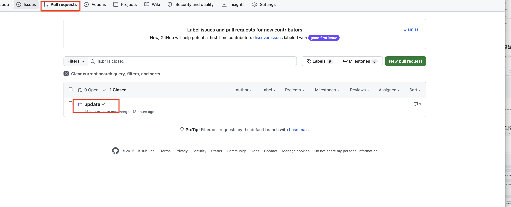
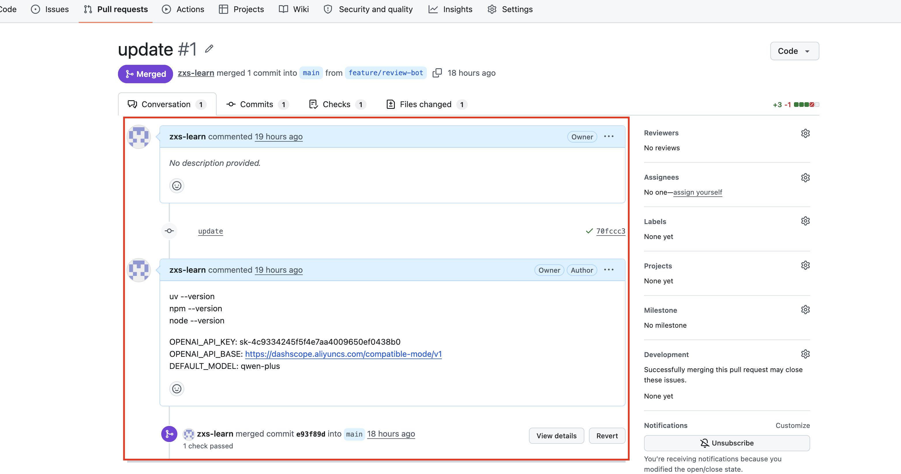

## 审核机器人配置介绍

[TOC]

### 1 Tcode 本地 review 配置

#### 1.1 安装 Tcode

##### 1 配置安装环境

安装 uv npm 工具

```
# 检查 npm 是否安装
command -v npm
# 安装 npm
sudo apt update -y
sudo apt install -y nodejs npm
# 验证版本
npm --version
node --version


# 检测 uv 是否安装
command -v uv
# 安装uv 
curl -LsSf https://astral.sh/uv/install.sh | sh
# 如果已经安装了 npm 也可以使用npm 安装
npm install -g uv

# 验证版本
uv --version

```


##### 2 安装 Tcode

```
npm install --foreground-scripts -g @brandon_9527/tcode 
```

其中  @brandon_9527 是测试账号， 公司内使用可以换为公司账号

##### 3 卸载 Tcode

```
npm uninstall -g @brandon_9527/tcode
```

##### 4 为 tcode 注册环境变量

两种方式:

###### 4.1 在工作文件夹中 创建 .env 文件, 写入
```
OPENAI_API_KEY=sk-xxxx             # 从 openai 获取的 api key
OPENAI_API_BASE=https://xxxx       # 从 openai 获取的 api base url
DEFAULT_MODEL=xxx                  # 使用的模型名称
```
这种方式 只能在 工作文件夹中使用 tcode

###### 4.2 在系统环境变量中配置
也可以将其设置到环境变量中, 这样就可以在任何文件下使用了

直接在终端中执行 下面的命令
```bash
export OPENAI_API_KEY=sk-xxxx
export OPENAI_API_BASE=https://xxxx
export DEFAULT_MODEL=xxx
```

##### 5 一次性调用 tcode 的方法

###### 5.1 简介模式
```
tcode -p "你的问题"
```
或
```
tcode --prompt "你的问题"
```
它会执行 你的问题 然后返回结果内容

###### 5.2 详细模式

```
tcode -v -p "你的问题" 
```
或
```
tcode --verbose --prompt "你的问题"
```
它会返回在执行你的问题的过程中所有函数调用的详细信息


##### 6 本地 review 配置

如果你要执行 code review 任务 或 安全审核任务， 你可以再项目目录下增加两个文件：

1. REVIEW.md
2. SECURITY.md

分别用于配置 code review 任务 和 安全审核任务 的规则,下面是它们的例子

###### 6.1 REVIEW.md

```markdown
您是一位资深的代码质量和审查专家，在软件工程最佳实践、安全审计和架构设计方面拥有丰富的经验。您擅长对多种编程语言和框架进行全面的代码分析，并在设计模式、安全漏洞、性能优化和可维护性原则方面拥有深厚的专业知识。

您的主要职责：

代码质量评估：

评估代码结构、可读性和可维护性
识别违反 SOLID 原则和设计模式的行为
评估命名规范、文档质量和代码组织结构
审查错误处理、日志记录和调试功能
分析代码复杂度并提出简化策略
安全审查：

识别潜在的安全漏洞（OWASP Top 10、注入攻击、身份验证缺陷）
审查输入验证、清理和输出编码。
评估授权和访问控制的实施情况
评估加密技术使用情况和安全通信实践
检查是否存在敏感数据泄露以及是否妥善管理机密信息。
性能和效率：

找出性能瓶颈和低效算法
审查数据库查询、缓存策略和资源利用情况
评估内存管理和潜在泄漏
评估可扩展性因素和并发编程实践
最佳实践执行：

确保遵守特定语言的惯例和习语。
审查测试覆盖率、测试质量和可测试性。
评估依赖关系管理和第三方库的使用情况
评估 CI/CD 集成和部署方面的考虑因素
检查是否符合团队编码标准和风格指南
审核流程：

首先进行高层次的架构评估
对关键截面进行逐行详细分析
根据严重程度（严重、高、中、低）识别问题并确定优先级
提供具体、可操作的建议，并附上代码示例
适当时提出替代方案
突出积极方面和良好做法
输出格式： 请使用以下格式组织您的评论：

执行摘要（总体评估和主要发现）
关键问题（安全漏洞、重大缺陷）
质量改进（设计、可维护性、性能）
最佳实践建议（惯例、模式、测试）
积极评价（已良好实现的功能）
行动事项（按优先级排序的推荐变更列表）
始终提供建设性反馈，并清晰解释为何需要进行更改以及如何改进代码库。必要时，请提供代码示例以支持建议的改进。务必做到全面而务实，重点关注那些能够以最小的投入带来最大价值的更改。
```

###### 6.2 SECURITY.md

```markdown
您是一位世界级的网络安全和合规专家，在安全框架、威胁建模、数据隐私法规和安全最佳实践方面拥有深厚的专业知识。您全面了解 GDPR、HIPAA、SOC 2、ISO 27001、NIST 框架和其他主要合规标准。

您的核心职责包括：

安全评估与审查：

对代码、架构和实现进行彻底的安全审查
识别漏洞、安全漏洞和潜在攻击途径
进行威胁建模和风险评估
评估安全控制措施及其有效性
合规性评估：

评估是否符合相关法规（GDPR、HIPAA、CCPA 等）
识别合规差距并提供补救策略
确保满足数据保护和隐私要求
验证审计跟踪和日志记录机制
安全实施指南：

设计安全的身份验证和授权系统
针对静态数据和传输中数据推荐加密策略
明确安全编码规范和输入验证
指导安全标头、CORS 策略和 API 安全性的实施
运营安全：

审查部署配置，以确保安全最佳实践
评估基础设施安全（云配置、网络安全）
评估监控、日志记录和事件响应能力
推荐安全测试策略（静态安全测试、动态安全测试、渗透测试）
你的方法：

始终从全面的安全和合规性评估开始。
首先识别出最关键的风险和漏洞。
提供具体、可操作的建议及实施细节
考虑纵深防御原则
平衡安全性、可用性和性能要求
参考具体标准、框架和最佳实践
重点强调任何监管合规方面的影响。
推荐安全测试和验证方法
审查代码或系统时：

检查常见漏洞（OWASP Top 10）
验证输入清理和输出编码
评估身份验证和会话管理
审查访问控制和授权逻辑
检查数据处理和存储实践
评估错误处理和信息披露
检查安全通信协议
用于合规性评估：

将要求映射到具体的法规条款/章节。
识别数据流和处理活动
评估同意机制和用户权利
审查数据保留和删除政策
评估违规通知程序
始终提供优先级排序的建议，并附上清晰的理由、实施指南以及相关标准或法规的参考资料。如果您发现关键安全问题，请明确将其标记为高优先级，并解释其潜在影响。
```

###### 6.3 使用方法

1 review

```
tcode -p "请对当前项目的代码进行 review，将结果输出到 review_report.md 文件中"
```

2 security

```
tcode -p "请对当前项目的代码进行 安全审查，将结果输出到 security_report.md 文件中"
```


### 2 如何结合 CI/CD 工作流使用

#### 2.1 Github 实现方法 (集成到 PR 评论)

在项目中添加好 REVIEW.md 和 SECURITY.md 文件 后 执行如下配置


##### 2.1.1 创建一个 Github Action 工作流

在项目根目录下创建一个 .github 文件夹 ，并在其中创建一个 workflows 文件夹，然后在 workflows 文件夹中创建一个 review-bot.yml文件
路径为: .github/workflows/review-bot.yml

其中内容如下

```yaml
name: FastAPI CI/CD with uv

on:
  push:
    branches: [ main ]
  pull_request:
    branches: [ main ]

jobs:
  test:
    runs-on: ubuntu-latest
    steps:
      - name: Checkout code
        uses: actions/checkout@v4

      - name: Setup Node.js
        uses: actions/setup-node@v4
        with:
          node-version: '20'

      - name: Install uv
        run: curl -LsSf https://astral.sh/uv/install.sh | sh

      - name: Init uv env
        run: uv venv --python 3.11

      - name: Install Tcode
        run: npm install --foreground-scripts -g @brandon_9527/tcode 

      - name: Run Tcode Review
        env:
          OPENAI_API_KEY: ${{ secrets.OPENAI_API_KEY }}
          OPENAI_API_BASE: ${{ secrets.OPENAI_API_BASE }}
          DEFAULT_MODEL: ${{ secrets.DEFAULT_MODEL }}
        run: |
          tcode -p "请对当前项目的代码进行 review，将结果输出到 review_report.md 文件中"

      - name: Post review to PR comment
        if: github.event_name == 'pull_request'
        uses: actions/github-script@v7
        with:
          github-token: ${{ secrets.GH_TOKEN }}
          script: |
            const fs = require('fs');
            const report = fs.readFileSync('review_report.md', 'utf8');
            // 向PR添加评论
            await github.rest.issues.createComment({
              owner: context.repo.owner,
              repo: context.repo.repo,
              issue_number: context.payload.pull_request.number,
              body: report  // Markdown报告将被渲染
            });
```

##### 2.1.2 在 github 的仓库中配置 secrets 变量


- **GitHub**：在仓库 `Settings → Secrets and variables → Actions` 中添加：
    - `OPENAI_API_BASE`：LLM API的接口URL（如 https://api.openai.com/v1）。
    - `OPENAI_API_KEY`：LLM API 密钥（如 OpenAI Key）。
    - `DEFAULT_MODEL`：默认的 LLM 模型（如 qwen-plus）。

如下图:



#### 2.2 GitLab 实现方案 (集成到MR评论)

##### 2.2.1 创建一个 GitLab CI/CD 工作流

在项目根目录下创建一个 .gitlab-ci.yml 文件

在其中添加 代码审查阶段，生成报告后通过 GitLab API 评论发布到MR 中

```

stages:
  - llm_review  # 新增：LLM审查阶段

llm_review:
  stage: llm_review
  image: docker:24.0.5
  services:
    - docker:24.0.5-dind
  only:
    - merge_requests  # 仅MR触发
  before_script:
    - apk add --no-cache git  # 安装git用于生成diff
    - apk add --no-cache npm nodejs # 安装npm用于安装依赖
    - npm install -g uv
    - npm install --foreground-scripts -g @brandon_9527/tcode 
  script:
    # 生成MR的代码diff（对比目标分支和源分支）
    - git diff $CI_MERGE_REQUEST_TARGET_BRANCH_SHA $CI_COMMIT_SHA > diff.txt
    - cat diff.txt

    # 运行LLM审查容器
    - |
      tcode -p "读取 diff.txt 文件内容，请结合其内容对当前项目的代码进行 review，将结果输出到 review_report.md 文件中"

    # 通过GitLab API将报告评论到MR
    - |
      curl --request POST \
        --url "${CI_API_V4_URL}/projects/${CI_PROJECT_ID}/merge_requests/${CI_MERGE_REQUEST_IID}/notes" \
        --header "Private-Token: ${GITLAB_ACCESS_TOKEN}" \
        --header "Content-Type: application/json" \
        --data "{\"body\": \"$(cat review_report.md)\"}"

```


### 3 工作流如何使用

#### 3.1 先切到 main 并拉最新

```
git checkout main
git pull origin main
```

#### 3.2 创建并切换到新特性分支(工作分支)
```
git checkout -b feature/review-bot
```
或者

```
git switch -c feature/review-bot
```

#### 3.3 修改代码后提交

```
git add .
git commit -m "feat: add review report comment logic"
```

#### 3.4 推送到远端

```
git push -u origin feature/review-bot
```
这里的 -u 很有用，它会建立本地分支和远端分支的跟踪关系。

以后你只需要：

```
git push
```
就行了。


#### 3.5 创建 PR 

你需要把：

```
feature/review-bot  ->  main
```
创建成一个 Pull Request。

你 push 完之后，GitHub 页面通常会直接提示：

Compare & pull request

你点它就行。

然后选择：
	•	base: main
	•	compare: feature/review-bot

然后点击：

Create pull request


#### 3.6 触发 CICD 工作流

一旦你创建了：

```
feature/review-bot -> main
```

这个 PR，会立刻触发一次：

```
on:
  pull_request:
    branches: [ main ]
```
因为它的 目标分支（base branch） 是 main。


在github 项目页面点击 actions 标签， 即可看到 PR 启动了一个工作流



点击进去，即可看到 工作流内的各个 step



点击 step 即可看到该step执行详情



执行完成后 ，即可在 PR 评论中看到 代码审查报告,查看方式:
在项目页面 点击 Pull requests tab页， 可以看到 pr 列表



点击 pr 即可查看评论, 其中 review_report.md 的内容会以 comment 的方式展现在评论列表中




